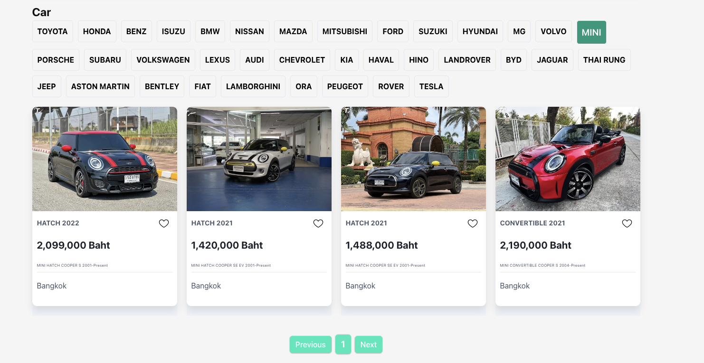

# Car Analytics

## Project Description

Car Analytics is a web application for market owners, offering detailed insights into various car models and brands. The platform features tables for model and brand comparisons, bar and pie charts for brand distribution, and car cards displaying essential details. Additionally, the highlight page allows users to view and manage their favorited cars.

## Features
**Dash Board**
- **Car Model Comparison:** Compare different car models based on various specifications such as engine performance, fuel efficiency, safety ratings, and more.
- **Interactive Visualizations:** Explore data through interactive charts and graphs that present car brand distribution in an easy-to-understand format.
- **Search Functionality:** Quickly find specific car models or brands using the powerful search feature.
- **Price Overview:** View and compare prices of various car models and brands in a clear and organized table.

**Car Cards**
- **Detailed Information:** Each car card displays essential details such as model, year, price, and location, giving market owners a quick overview of the cars available.
- **Favorite Feature:** Easily mark cars as favorites to keep track of them for future reference.

**Highlight Page**
- **Favorited Cars Display:** View all the cars you’ve favorited in one place, organized similarly to the dashboard but without pagination.
- **Remove from Highlights:** Quickly remove cars from your favorites with a single click.

## Screenshots
- **Main Menu:** This is the main navigation of the project: Dashboard & Highlight.

    </img>

- **Visual Display (Pie Chart):** This Pie Chart shows the car brand distribution.

    </img>

- **Visual Display (Stacked Bar Chart):** This Stacked Bar Chart shows the car model distribution by brand.

    </img>

- **Car Data Table:** This table shows the car brand, its model, the number of car available and the total value (in baht)

    </img>

- **Car card:** This part display all the car card with its details. Additionally, it includes fitering for each brand and pagination to view more cars

    </img>

- **Highlight:** This highlight page include all the car that you have chosen (by clicking heart button)

    </img>

## Project Members

**CSX4107-WAD Sec542**
- **6530173 - Moe Myint Mo San** 
- **6530327 - Bhone Pyae Kyaw** 
- **6530377 - Kyaw Ye Lwin @ ANMOL** 

## Getting Started

1. Clone the repository: `git clone https://github.com/yourusername/wad-p1-car-analytics.git`
2. Navigate to the project directory: `cd wad-p1-car-analytics`
3. Install dependencies: `npm install`
4. Run the application: `npm start`
5. Access the app at `http://localhost:3000` in your web browser.

## Technologies Used
- React - JavaScript Library for user interface, used as core framework for this project.
- CSS - Styling language used for layout design and custom component.
- Chart.js - Javascript charting library (via react-chartjs-2) for creating interactive visualization: pie and bar chart.
- React Router - Library for handling navigation and routing within the project.
- Local Storage - Web Storage API used for user's favorite car selections.
- JSON - Data format used for storing and parsing car data.
- React hooks: React feature used for state management and side effect in functional components. 
 

